# Crawler

Capstone project

## 프로젝트 개요

기존의 웹 크롤러들은 웹 페이지에서 정보를 추출할 부분의 html tag 또는 css를 사람이 직접 수집해 모듈에 추가 해야함

또한 해당 페이지의 구조(html 문서상의 tag나 css)가 변경되는 경우 사람이 직접 모듈을 유지보수 해야하는 단점이 존재

이러한 단점들을 개선하기 위해 머신러닝을 활용하고 사람의 노동력을 최소화하고 html tag나 css에 관계 없이 웹 페이지에서 본문 내용을 추출하는 웹 크롤링 모듈을 개발

크롤링 모듈은 Node.js 모듈과 python 모듈로 구성

Node.js 모듈은 DOM tree를 파싱해 웹 페이지에서 노드 단위로 정보들을 추출

Python 모듈은 Node.js에서 추출한 노드 단위 정보들을 블록 단위로 묶고 머신러닝 모델에 입력해 해당 블록이 본문 내용인지 아닌지 분류

머신러닝 모듈은 python 오픈소스 라이브러리인 scikit-learn의 SVM 모듈을 사용

타겟 웹 페이지는 국내 뉴스, 블로그, 쇼핑몰 사이트 3개의 카테고리로 지정

카테고리마다 각각의 SVM 모델을 학습시켰고 블록 단위를 입력으로 받고 2단계의 SVM 모델을 거쳐 제목, 텍스트, 이미지를 추출(본문 분류 -> 제목 분류)

## 모듈 작동

1. Python 모듈에 url 입력
2. Node.js 모듈에 url 전달
3. Node.js 모듈이 DOM tree를 파싱해 노드 단위의 정보 추출
4. Python 모듈에
   추출한 노드 정보 전달
5. Python 모듈이
   노드 단위의 정보를 블록 단위로 묶음
6. 블록 단위로 머신러닝 모델에 입력해 본문 내용인지
   아닌지 분류
7. 본문으로 분류된 블록들을 또 하나의 머신러닝 모델에
   입력해 제목과 본문 내용으로 분류
8. 웹 페이지의 본문을 제목, 텍스트, 이미지로 구분해 출력

## 모듈 설명

* Parser
* BlockMaker
* ContentExtractor
* Crawler
* DataCreator
* LearningManager

### Parser

Parser는 Parser.js와 Parser.py로 구성

Parser.py가 본문 내용을 추출할 웹 페이지의 url을 메세지 큐를 사용해 Parser.js로 전달

Parser.js는 Node.js 모듈로 오픈소스 라이브러리 puppeteer를 사용해 전달받은 url에 접속해 해당웹 페이지의 DOM tree를 파싱하고 노드 단위의 정보를 추출

DOM tree에서 모든 노드를 방문하며 노드들의 타입(이미지 또는 텍스트), 내용(이미지의 경우는 url)과 노드의 X,Y 좌표, 넓이, 높이, 글씨크기(이미지의 경우는 0) 총 5가지의 특징 정보를 추출해서 저장

노드 단위에서 본문이 아닌 내용으로 판단할 수 있는 정보들을 전처리해서 제외시킴 (데이터 부분에서 자세히 기술)

추출한 노드 단위의 정보들을 메세지 큐를 사용해 다시 Parser.py에 전달

Parser.py는 전달받은 노드 단위의 정보들을 리스트 형태로 BlockMaker.py에 전달

### BlockMaker

BlockMaker.py는 Parser.py로부터 전달받은 노드 단위의 정보들을 한 단계 큰 단위인 블록 단위로 묶음

노드 리스트를 순회하며 다음과 같은 알고리즘을 사용해 블록 단위로 묶음

1. 노드 리스트는 앞에서부터 차례대로 순회하며 아래 기준들에 따라 같은 블록으로 판단되는 노드들을 bindnode 리스트에 추가

   현재 순회중인 노드 리스트의 노드가 bindnode 리스트 내의 노드들과 다른 블록으로 판단되면 bindnode 리스트의 노드들을 하나의 블록으로 변환하고 bindnode 리스트를 초기화

2. 이미지 노드인 경우 해당 하나의 노드 자체를 하나의 블록으로 변환

3. 텍스트 노드의 경우 글씨크기의 차이가 정해진 threshold 값보다 큰 경우 서로 다른 블록으로 판단(본 모듈에서는 5의 threshold를 사용)

   threshold 값보다 작거나 같은 경우 4번 기준에 따라 판단

4. x좌표와 y좌표의 차이를 계산하고 정해진 threshold 값보다 작은 경우 같은 블록으로 묶고 아닌 경우 다른 블록으로 판단(본 모듈에서는 x,y 좌표의 threshold 값을 각각 100,20으로 사용)

5. 3과 4번의 기준은 현재 순회중인 노드 리스트의 노드와 bindnode 리스트의 마지막 노드를 비교

6. 블록의 특징 정보는 X,Y 좌표, 넓이, 높이, 글씨크기(이미지의 경우 0)를 사용

   X,Y 좌표는 노드들의 중점을 사용

   넓이, 높이는 노드들을 모두 포함할 수 있는 넓이, 높이 값을 사용함

   글씨크기는 노드들의 평균값을 사용

위의 알고리즘을 통해 만들어진 블록 정보들을 블록 리스트에 저장

블록 리스트를 Crawler.py에 전달

블록의 X,Y 좌표, 넓이, 높이는 모두 웹 페이지 전체의 크기에 대한 비율로 계산(0.0~1.0)

### ContentExtractor

ContentExtractor.py는 학습이 완료된 SVM 모델과 Scikit-learn의 전처리 모델인 StandarScaler 모델을 불러와 전달받은 블록 리스트를 전처리를 거쳐 SVM 모델에 입력

SVM 모델은 뉴스, 블로그, 쇼핑몰 카테고리별로 각각 1개의 StandardScaler 모델과 2개의 SVM 모델(본문 분류, 제목 분류)을 가짐

전처리를 거친 블록들은 첫번째 SVM 모델에 입력되어 본문인지 아닌지 분류

본문으로 분류된 블록들을 다시 두번째 SVM 모델에 입력해 제목과 본문으로 분류

SVM 모델을 거쳐 추출한 제목, 텍스트, 이미지 정보를 Crawler.py에 전달

### Crawler

Crawler.py는 본 크롤링 모듈의 메인 소스이고 크롤링할 웹 페이지의 url과 해당 페이지의 카테고리를 입력 받아 프로그램을 실행

Crawler.py에 url을 입력하면 url 정보가 Crawler.py => BlockMaker.py => Parser.py => Parser.js 순서로 전달

블록 정보는 BlockMaker.py -> Cralwer.py -> ContentExtractor.py 순서로 전달

ContentExtractor.py에서 전달받은 웹 페이지의 제목, 텍스트, 이미지 정보를 출력

### DataCreator

DataCreator.py는 페이지의 카테고리와 해당 카테고리의 페이지 url의 리스트를 입력 받아 url들을 BlockMaker.py에 전달

BlockMaker.py로부터 해당 url 페이지의 블록 정보들을 전달받아 CSV 파일을 생성

DataCreator.py를 통해 label이 없는 블록 데이터를 생성

### LearningManager

LearningManager.py는 학습 데이터를 입력 받아 SVM 모델과 StandardScaler 모델을 학습

뉴스, 블로그, 쇼핑몰 카테고리별로 각각의 SVM, StandardScaler 모델을 학습

학습한 모델은 Scikit-learn의 joblib을 사용해 pkl 파일로 저장

## 데이터

DataCreator.py를 사용해 label이 없는 블록 단위의 데이터를 CSV 파일로 생성

CSV 파일은 블록의 내용(이미지의 경우는 url), X,Y 좌표, 넓이, 높이, 글씨크기(이미지의 경우는 0) 정보를 가짐

CSV 파일에 블록마다 직접 label을 부여(본문 내용이면 1, 본문이 아니면 0)해 학습 데이터를 생성

뉴스, 블로그, 쇼핑몰 카테고리별로 각각 2종류의 데이터를 생성(본문 분류, 제목 분류), 즉, 총 6종류의 학습 데이터를 생성

뉴스, 블로그, 쇼핑몰 카테고리별로 각각 약 4500개, 4800개, 4400개의 학습 데이터와 1100개, 1200개, 800개의 테스트 데이터를 사용

### 데이터 분포

X,Y 좌표 / X,Y 좌표와 넓이 / PCA를 사용해 5차원의 특징을 3차원으로 압축한 값들에 따른 뉴스 학습 데이터의 분포

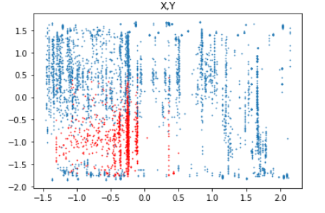

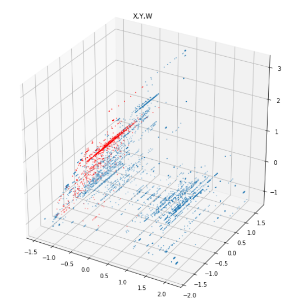

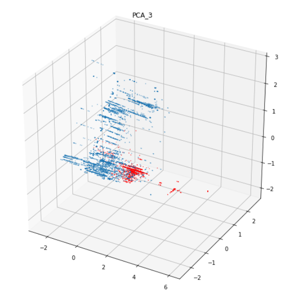

X,Y 좌표 / X,Y 좌표와 넓이 / PCA를 사용해 5차원의 특징을 3차원으로 압축한 값들에 따른 블로그 학습 데이터의
분포

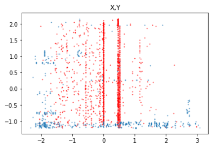

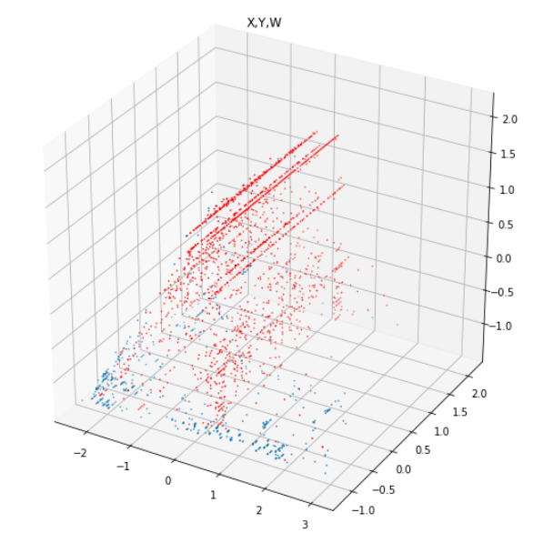

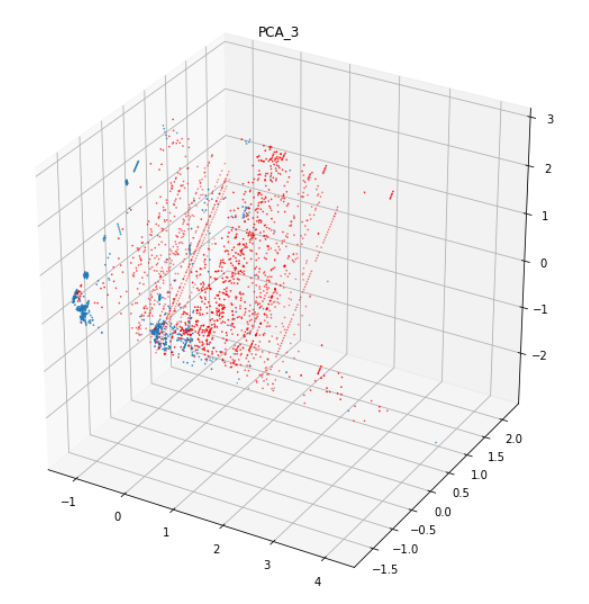

X,Y 좌표 / X,Y 좌표와 넓이 / PCA를 사용해 5차원의 특징을 3차원으로 압축한 값들에 따른 쇼핑몰 학습 데이터의
분포

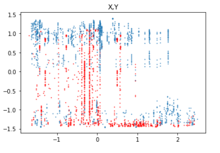

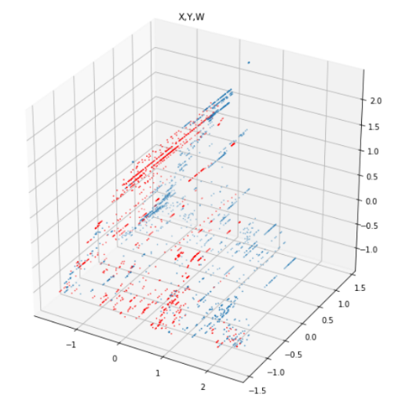

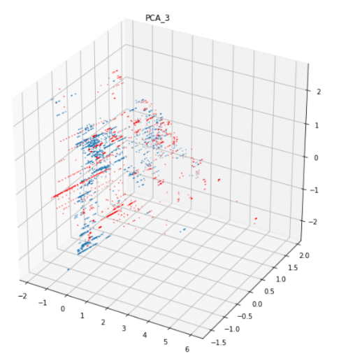

### 데이터 전처리

다양한 형태의 웹 페이지들을 머신러닝 기술만을 사용해 정확하게 처리하는 것은 어려움이 있어 노드 단위에서 본문이 아니라고 판단할 수 있는 노드들은 전처리를 통해 제거

* 뉴스

  * 다른 도메인 또는 다른 머신으로 링크가 연결된 <a> tag의 노드를 제거

* 블로그

  * 다른 도메인 또는 다른 머신으로 링크가 연결된 <a> tag의 노드를 제거

  * id나 class 이름에 category, plugin, player, map이 포함된 
, 
, , <dl>tag의 노드를 제거

  * id나 class 이름에 tag, ccl, comment, #post이 포함된 
, 
, , <dl> tag의 노드중에서 y좌표가 50%를 넘어가는 노드들을 모두 찾음

    y좌표가 가장 높은(가장 아래쪽에 있는) tag, ccl, comment, #post를 각각 찾음

    이 중에서 가장 y좌표가 낮은(가장 위쪽에 있는) 값을 bottom line으로 설정

    bottom line아래에 위치한 노드들을 전부 제거

* 쇼핑몰
  * 링크가 걸린 a태그의 가장 가까운 부모 
, 
, 을 찾아서 제거

## 결과 & 성능

뉴스, 블로그, 쇼핑몰 카테고리별로 각각 약 4500개, 4800개, 4400개의 학습 데이터를 사용해 SVM 모델을 학습

모델을 학습하며 5-fold Cross Validation으로 학습 데이터에 대한 성능을 검증

각각 1100개, 1200개, 800개의 테스트 데이터를 사용해 모델의 성능을 검증

성능 검증 지표로는 Accuracy와 F1-Score를 사용

뉴스 모델의 Decision Boundary와 성능

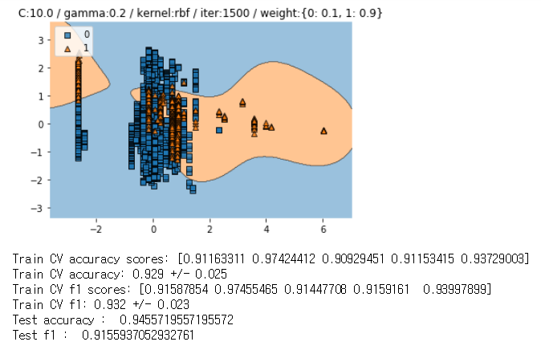

뉴스 모델의 테스트 데이터에 대한 Confusion Matrix

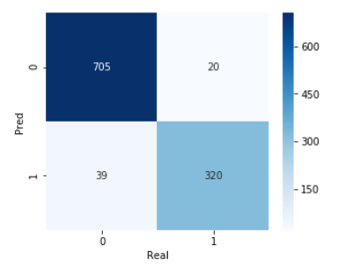

블로그 모델의 Decision Boundary와 성능

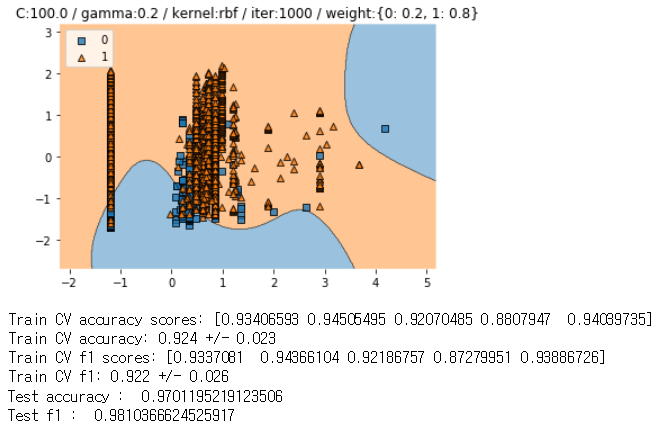

블로그 모델의 테스트 데이터에 대한 Confusion Matrix

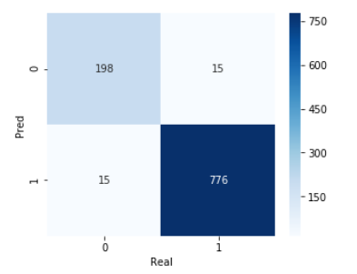

쇼핑몰 모델의 Decision Boundary와 성능

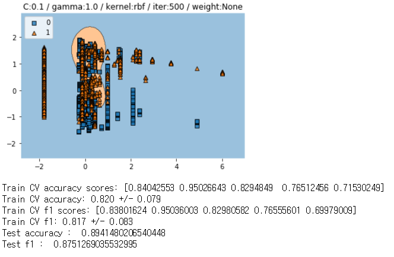

쇼핑몰 모델의 테스트 데이터에 대한 Confusion Matrix

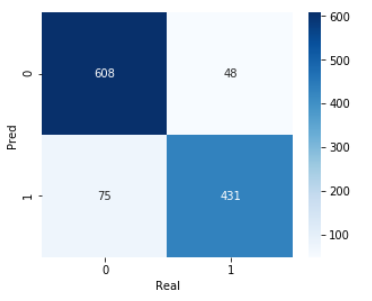

## 개선 사항

* 노드 단위를 블록으로 묶는 블록화 알고리즘을 좀 더 정교하게 개선

* 더 다양한 학습 데이터를 수집

* 메세지 큐가 불안정한 문제가 있어 이를 보완하거나 Node.js와 Python사이에서 정보를 전송하는 다른 방법을 도입

* 노드 단위의 Rule 기반 전처리 방식을 좀 더 정교하게 개선하고 특정 사이트들에 제한되지 않도록 일반화

* Node.js 모듈의 속도 향상